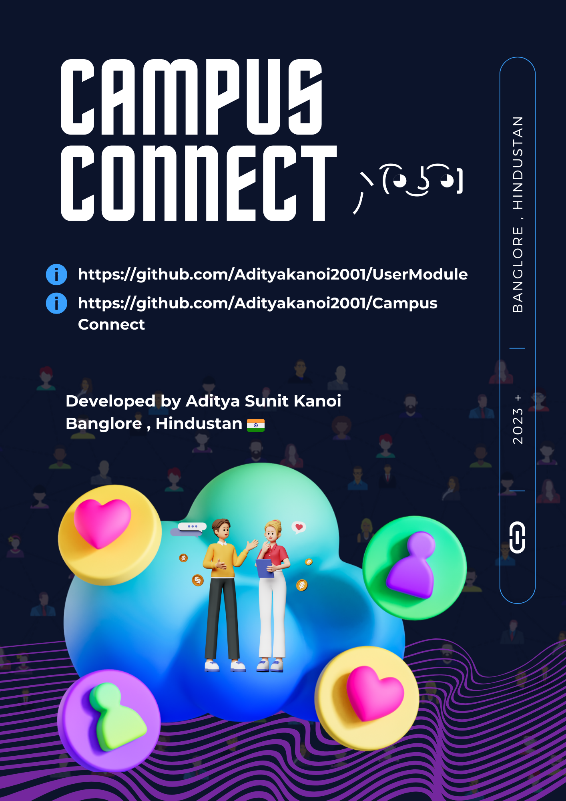

# CampusConnect - Connect, Chat, and Share on Campus

# UserModule
User Module for CampusConnect - Independent Microservice for User Sign-In Sign-Up Functionality and Many User Based Features

Version: Stable Runway : 1.0.0
Project for Campus Communication and Sharing Platform

Developed By Aditya Sunit Kanoi 👨‍💻

---

CampusConnect is a versatile platform designed to foster connections among students on campus. It enables students to engage in real-time chat conversations, share posts, and build a vibrant campus community.

## Features

📢 **Real-time Chat**: Connect with fellow students through instant messaging within the campus.

📝 **Post Sharing**: Share posts, announcements, and updates with the campus community.

👥 **User Profiles**: Customize your user profile and connect with others based on interests and majors.

🏫 **Campus Directory**: Access a directory of students, faculty, and staff for easy communication.

🔎 **Search Functionality**: Find specific users and posts quickly with a robust search feature.

📅 **Event Announcements**: Stay informed about campus events, club meetings, and important dates.

## Technologies Used

- Spring Boot: Backend development for the application.
- ReactJS: Frontend user interface for an interactive user experience.
- WebSocket: Powering real-time chat functionality.
- MongoDB: Storing user data, posts, and chat messages.
- AI based Model for Personalized Feature.

## How to Use

1. Clone the repository to your local machine.
2. Run the application using your preferred IDE or by following the provided setup instructions.
3. Access the CampusConnect application via the web browser.

## Endpoints

Access the CampusConnect application through the provided web interface to explore its features and functionalities.

### 1. Chat with Campus Community

- **Description**: Start a conversation with fellow students, faculty, or staff members.
- **Usage**: Access the chat feature from the main dashboard.
- **Benefits**: Instant communication for academic discussions, project collaboration, or socializing.

### 2. Share Campus Updates

- **Description**: Post announcements, event details, or general updates for the campus community.
- **Usage**: Create and share posts through the "Post" section of the application.
- **Benefits**: Keep everyone informed about important news and events on campus.

### 3. Explore User Profiles

- **Description**: View and customize your user profile with interests, majors, and more.
- **Usage**: Access your profile settings and interact with others based on shared interests.
- **Benefits**: Build connections with like-minded individuals on campus.

### 4. Campus Directory

- **Description**: Browse through a directory of campus members for easy communication.
- **Usage**: Search for specific users or browse by department and year.
- **Benefits**: Connect with classmates, faculty, and staff effortlessly.

## Performance

[Performance data and metrics can be included here.]

## How to Contribute

Contributions to CampusConnect are highly encouraged! If you have ideas for improvements, features, or bug fixes, please don't hesitate to get involved.

🌟 Please star the repository if you find CampusConnect helpful!

Thank you for being a part of the CampusConnect community! 😊

---

# 💡 UPCOMING FEATURES!!

- [ ] 📚 **Study Groups Creation**
  Form and join study groups with students sharing your academic interests and courses.

- [ ] 📢 **Campus Newsfeed**
  Stay updated with a real-time newsfeed featuring campus-wide announcements.

- [ ] 🎉 **Event RSVPs and Reminders**
  RSVP to events and receive reminders for upcoming campus activities.

- [ ] 🎓 **Alumni Network**
  Connect with alumni to gain insights and career advice.

Stay tuned for these exciting updates! 🔥💯🚀

Feel free to reach out if you have any suggestions or questions in CampusConnect Project Chat. We're committed to enhancing your campus experience. Happy connecting on CampusConnect! 😄📚🎉
